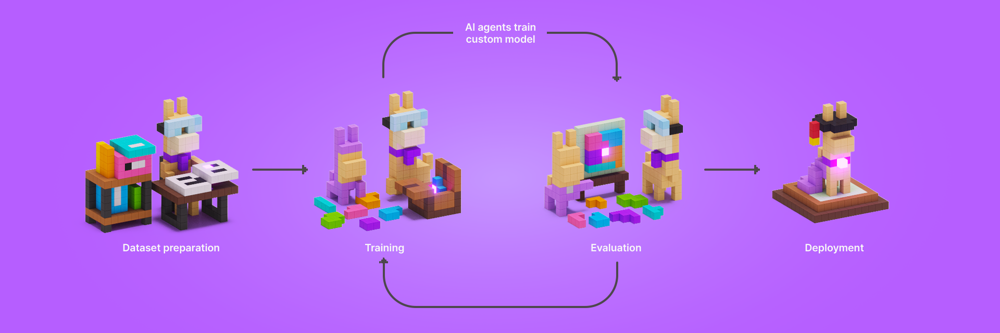

# Early Alpha version of LlamaFactory.AI - your personal AI model factory powered by Llama. 


[LlamaFactory.AI](https://llamafactory.ai/)

This web application enables users to create custom language models tailored to their specific needs in just minutes. Simply describe your task, provide input/output examples through a JSON file, and let LlamaFactory.AI handle the complexities of model training. With an intuitive interface, real-time training visualizations, and automated deployment, you can transform your data into a production-ready AI model without any technical expertise. Whether you're building a sentiment analyzer, content moderator, or specialized chatbot, LlamaFactory.AI streamlines the entire process from data to deployment. Our platform leverages the powerful Llama architecture while abstracting away the technical complexities of model training, making AI customization accessible to everyone.

# LLM Pairwise Evaluation Tool

This tool performs pairwise comparison of Large Language Model (LLM) outputs using Claude 3.5 Sonnet as a judge. It evaluates model-generated responses against reference answers based on multiple criteria and produces detailed analysis of the results.

## Prerequisites

- Python 3.7+
- Anthropic API key

```bash
cd evaluation/pairwise_eval
```

## Required Python Packages

Install the required packages using:
```bash
pip install pandas anthropic tqdm matplotlib typing
```

## Input Data Format

Your input CSV file must contain the following columns:

- `input`: The original prompt/question given to the models
- `answer`: The reference/ground truth answer
- `generated_text`: The model-generated response to be evaluated
- `model`: The name/identifier of the model that generated the response

Example CSV format:
```csv
input,answer,generated_text,model
"What is Python?","Python is a high-level programming language...","Python is a versatile programming language...","gpt-4"
```

## Setup

1. Set your Anthropic API key as an environment variable:
```bash
export ANTHROPIC_API_KEY="your-api-key-here"
```

2. Place your evaluation data in a CSV file following the format described above.

## Usage

Run the script by providing the path to your input CSV file:

```bash
python evaluation_script.py path/to/your/input.csv
```

## How It Works

1. The script processes the input CSV in batches (default batch size: 4)
2. For each entry, it:
   - Randomly assigns the generated text and reference answer as output_1 or output_2
   - Creates a structured prompt for Claude to evaluate both outputs
   - Collects Claude's evaluation based on:
     - Relevance and Accuracy
     - Comprehensiveness and Depth
     - Structure and Clarity

3. The evaluation results are analyzed to calculate:
   - Win rates (when generated text is preferred)
   - Tie rates (when both outputs are deemed equal)
   - Loss rates (when reference answer is preferred)

## Output Files

The script generates three types of outputs:

1. `evaluation_results.csv`: Contains detailed results for each evaluation, including:
   - Model name
   - Winner (generated_text/answer/tie)
   - Explanation of the decision

2. `analysis_results.csv`: Contains aggregated statistics for each model:
   - Win rate
   - Tie rate
   - Loss rate

3. `model_comparison_results.png`: A bar chart visualization showing:
   - Win rates (green)
   - Tie rates (yellow)
   - Loss rates (red)


## Notes

- The evaluation is performed asynchronously to improve processing speed
- Results are appended to existing output files if they exist
- The evaluation uses Claude 3.5 Sonnet model for judging
- Each evaluation considers multiple aspects of the responses to ensure comprehensive comparison

## Limitations

- Requires an active Anthropic API key with sufficient quota
- Processing time depends on the size of your input dataset and API rate limits
- Evaluation costs will vary based on the size of inputs and number of comparisons

For any issues, check the console output for error messages and ensure all prerequisites are properly set up.